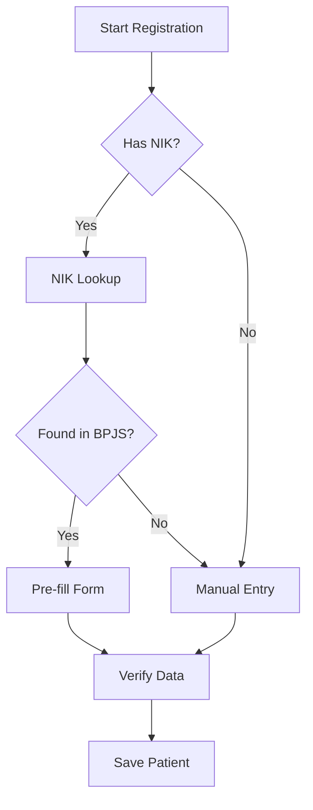

# NIK Lookup Functionality Reference

## Overview
The NIK (Nomor Induk Kependudukan) lookup functionality allows healthcare providers to verify and retrieve patient information from BPJS using the Indonesian National ID number.

## API Documentation Locations

### 1. Service Implementation Files
The API documentation is embedded in the following files:
- `/var/www/html/production/webapps/webservice/module/BPJService/src/BPJService/VClaim/v_1_0/Service.php`
- `/var/www/html/production/webapps/webservice/module/BPJService/src/BPJService/VClaim/v_1_1/Service.php`
- `/var/www/html/production/webapps/webservice/module/BPJService/src/BPJService/VClaim/v_2_0/Service.php`

### 2. Version Support
The codebase supports multiple versions of the BPJS VClaim API:
- v1.0 - Base implementation
- v1.1 - Enhanced features
- v2.0 - Latest version with additional features

### 3. Documentation Format
The API documentation is written in PHPDoc format within the code:
```php
/**
 * cari data rujukan berdasarkan Nomor Kartu BPJS
 * @parameter 
 *   $params string | array("noKartu" => value)
 *   $uri string
 */
```

### 4. Service Modules
Documentation is organized by service modules:
- PesertaService - Patient/Member services
- SEPService - Hospital eligibility services
- ReferensiService - Reference data services
- RujukanService - Referral services
- MonitoringService - Monitoring services
- RencanaKontrolService - Control plan services
- PRBService - PRB services
- LPKService - Claim submission services

## BPJS API Documentation Resources

### 1. Official Documentation
- Main Documentation Portal: https://dvlp.bpjs-kesehatan.go.id:8888/trust-mark/
- VClaim Documentation: https://dvlp.bpjs-kesehatan.go.id/VClaim-Katalog/
- E-KATALOG Documentation: https://e-katalog.bpjs-kesehatan.go.id/

### 2. Developer Resources
- Developer Portal: https://new-api.bpjs-kesehatan.go.id/new-vclaim-rest/
- API Testing Console: https://apijkn-dev.bpjs-kesehatan.go.id/vclaim-rest/
- Documentation Downloads: https://dvlp.bpjs-kesehatan.go.id/VClaim-Katalog/docs

### 3. Registration & Access
To get API access:
1. Visit https://dvlp.bpjs-kesehatan.go.id/
2. Register your healthcare facility
3. Request credentials (consumer ID and secret key)
4. Complete the integration verification process

### 4. Support Channels
- Technical Support: vclaim@bpjs-kesehatan.go.id
- Integration Support Portal: https://dvlp.bpjs-kesehatan.go.id/support
- Phone: (021) 424 6063

## BPJS API Configuration

### 1. Base URLs
```properties
# Production Environment
BPJS_API_PROD_URL=https://new-api.bpjs-kesehatan.go.id/new-vclaim-rest/

# Development/Testing Environment
BPJS_API_DEV_URL=https://dvlp.bpjs-kesehatan.go.id/vclaim-rest-dev/

# Demonstration Environment
BPJS_API_DEMO_URL=https://apijkn-dev.bpjs-kesehatan.go.id/vclaim-rest/
```

### 2. Authentication URLs
```properties
# OAuth 2.0 Token Endpoint
BPJS_AUTH_URL=https://new-api.bpjs-kesehatan.go.id/new-vclaim-auth/

# Development Auth
BPJS_AUTH_DEV_URL=https://dvlp.bpjs-kesehatan.go.id/vclaim-auth-dev/
```

### 3. Required Headers
```php
$headers = [
    'X-Cons-ID' => '{your-consumer-id}',
    'X-Timestamp' => date('Y-m-d H:i:s'),
    'X-Signature' => generateHmacSignature($requestBody),
    'user_key' => '{your-user-key}',
    'Content-Type' => 'application/json'
];
```

### 4. Complete Endpoint List
```properties
# Peserta (Participant) Endpoints
PESERTA_NIK_URL=/Peserta/nik/{nik}
PESERTA_KARTU_URL=/Peserta/nokartu/{nokartu}
PESERTA_HISTORY_URL=/monitoring/HistoriPelayanan/NoKartu/{nokartu}/tglMulai/{from}/tglAkhir/{to}

# Authentication Endpoints
AUTH_TOKEN_URL=/token
AUTH_REFRESH_URL=/refresh

# Reference Data Endpoints
REF_DIAGNOSA_URL=/referensi/diagnosa/{keyword}
REF_POLI_URL=/referensi/poli/{keyword}
REF_FASKES_URL=/referensi/faskes/{kd_faskes}/{jns_faskes}
```

## Technical Specification

### 1. API Endpoint
```
GET /Peserta/peserta/nik/{nik}
```

### 2. Request Parameters
- Required:
  - `nik`: String (16 digits)
- Optional:
  - `norm`: String (Medical Record Number)

### 3. Response Structure
```json
{
    "metadata": {
        "message": "OK",
        "code": 200,
        "requestId": "hospital_code"
    },
    "response": {
        "peserta": {
            "noKartu": "string",      // BPJS Card Number
            "nik": "string",          // National ID
            "norm": "string",         // Medical Record Number
            "nama": "string",         // Patient Name
            "pisa": "string",         // Insurance Status
            "sex": "string",          // Gender
            "tglLahir": "YYYY-MM-DD", // Date of Birth
            "tglCetakKartu": "YYYY-MM-DD", // Card Print Date
            "kelasTanggungan": {
                "kdKelas": "string"   // Insurance Class Code
            }
        }
    }
}
```

### 4. Error Codes
```json
{
    "metadata": {
        "message": "Error Message",
        "code": "Error Code",
        "requestId": "hospital_code"
    }
}
```
- `200`: Success
- `412`: Invalid Data/Format
- `502`: Service Unavailable
- `404`: Data Not Found

## Implementation Details

### 1. Core Function Structure
```php
function cariPesertaDgnNIK($params, $uri = "Peserta/peserta/nik/") {
    // 1. Parameter extraction
    $nomor = is_array($params) ? $params["nik"] : $params;
    $norm = is_array($params) ? ($params["norm"] ?? 0) : 0;

    // 2. API request
    $result = sendRequest($uri.$nomor);

    // 3. Response processing
    if ($result) {
        // Add hospital identifier
        $result->metadata->requestId = hospital_code;
        
        // 4. Cache successful results
        if ($result->metadata->code == 200) {
            $peserta = $result->response->peserta;
            storePeserta($norm, $peserta);
        }
    }

    // 5. Return result or error
    return $result ?? generateErrorResponse();
}
```

### 2. Local Caching Implementation
```sql
-- Cache Table Structure
CREATE TABLE bpjs_peserta_cache (
    id BIGINT PRIMARY KEY AUTO_INCREMENT,
    nik VARCHAR(16) UNIQUE,
    norm VARCHAR(20),
    bpjs_data JSON,
    last_updated TIMESTAMP,
    is_valid BOOLEAN DEFAULT true,
    INDEX idx_nik (nik),
    INDEX idx_norm (norm)
);
```

### 3. Fallback Mechanism
```php
function getPesertaData($nik, $norm = null) {
    // 1. Try BPJS API
    $result = cariPesertaDgnNIK(["nik" => $nik, "norm" => $norm]);
    
    // 2. If API fails, check cache
    if (!isSuccessful($result)) {
        $cached = getCachedData($nik);
        if ($cached) {
            return formatCachedResponse($cached);
        }
    }
    
    return $result;
}
```

## Security Considerations

### 1. Data Protection
- NIK numbers must be encrypted at rest
- Implement access logging for all NIK lookups
- Clear cache based on configurable retention policy

### 2. Request Validation
```php
function validateNIK($nik) {
    // 1. Check length
    if (strlen($nik) !== 16) return false;
    
    // 2. Verify numeric
    if (!is_numeric($nik)) return false;
    
    // 3. Validate province code (first 2 digits)
    $provinceCode = substr($nik, 0, 2);
    if (!isValidProvinceCode($provinceCode)) return false;
    
    // 4. Validate date components
    $dateComponents = substr($nik, 6, 6);
    if (!isValidDateFormat($dateComponents)) return false;
    
    return true;
}
```

### 3. Rate Limiting
```php
function checkRateLimit($requestor_id) {
    $limit = 100; // requests
    $window = 3600; // seconds (1 hour)
    
    return isWithinLimit($requestor_id, $limit, $window);
}
```

## Integration Points

### 1. Patient Registration Flow


### 2. Data Synchronization
```php
class BPJSDataSync {
    // Sync frequency: Every 24 hours
    const SYNC_INTERVAL = 86400;
    
    function syncCachedData() {
        $expiredCache = getExpiredCache(self::SYNC_INTERVAL);
        foreach ($expiredCache as $record) {
            $fresh = cariPesertaDgnNIK($record->nik);
            if (isSuccessful($fresh)) {
                updateCache($record->id, $fresh);
            }
        }
    }
}
```

## Error Handling

### 1. Common Errors and Solutions
1. Invalid NIK Format
   ```php
   if (!validateNIK($nik)) {
       return [
           'error' => 'INVALID_NIK_FORMAT',
           'message' => 'NIK must be 16 digits'
       ];
   }
   ```

2. Service Unavailable
   ```php
   if (!isServiceAvailable()) {
       logServiceOutage();
       return getCachedResponse($nik) ?? [
           'error' => 'SERVICE_UNAVAILABLE',
           'message' => 'Using cached data if available'
       ];
   }
   ```

3. Data Not Found
   ```php
   if ($response->code === 404) {
       logNotFound($nik);
       return [
           'error' => 'NOT_FOUND',
           'message' => 'No BPJS data found for NIK'
       ];
   }
   ```

### 2. Logging Strategy
```php
function logNIKLookup($nik, $status, $response) {
    $log = [
        'timestamp' => now(),
        'nik' => maskNIK($nik),  // Only store last 4 digits
        'status' => $status,
        'response_code' => $response->code,
        'user_id' => getCurrentUser(),
        'ip_address' => getClientIP()
    ];
    
    writeToSecureLog($log);
}
```

## Testing Scenarios

### 1. Unit Tests
```php
class NIKLookupTest {
    function testValidNIK() {
        $result = validateNIK("1234567890123456");
        assert($result === true);
    }
    
    function testInvalidNIK() {
        $result = validateNIK("123");
        assert($result === false);
    }
    
    function testCacheRetrieval() {
        $cached = getCachedData("1234567890123456");
        assert($cached !== null);
    }
}
```

### 2. Integration Tests
```php
class BPJSIntegrationTest {
    function testLiveNIKLookup() {
        $result = cariPesertaDgnNIK("1234567890123456");
        assert($result->metadata->code === 200);
    }
    
    function testFallbackMechanism() {
        mockServiceOutage();
        $result = getPesertaData("1234567890123456");
        assert($result->source === "cache");
    }
}
```

## Performance Optimization

### 1. Caching Strategy
```php
class CacheManager {
    const CACHE_DURATION = 86400; // 24 hours
    
    function getCachedPeserta($nik) {
        $cached = redis()->get("peserta:$nik");
        if ($cached && !isExpired($cached)) {
            return json_decode($cached);
        }
        return null;
    }
    
    function cachePeserta($nik, $data) {
        redis()->setex(
            "peserta:$nik",
            self::CACHE_DURATION,
            json_encode($data)
        );
    }
}
```

### 2. Batch Processing
```php
function batchNIKLookup($nikList) {
    $results = [];
    $uncached = [];
    
    // Check cache first
    foreach ($nikList as $nik) {
        $cached = getCachedPeserta($nik);
        if ($cached) {
            $results[$nik] = $cached;
        } else {
            $uncached[] = $nik;
        }
    }
    
    // Fetch uncached in parallel
    $apiResults = parallelAPIRequest($uncached);
    
    return array_merge($results, $apiResults);
}
```

## Monitoring and Maintenance

### 1. Health Checks
```php
function checkNIKLookupHealth() {
    return [
        'api_status' => checkAPIStatus(),
        'cache_status' => checkCacheStatus(),
        'error_rate' => getErrorRate('1h'),
        'average_response_time' => getAverageResponseTime('1h'),
        'cache_hit_ratio' => getCacheHitRatio('1h')
    ];
}
```

### 2. Maintenance Tasks
```php
class MaintenanceTasks {
    function cleanupExpiredCache() {
        $threshold = now() - (30 * 86400); // 30 days
        deleteExpiredCache($threshold);
    }
    
    function validateCachedData() {
        $invalidRecords = findInvalidCacheRecords();
        foreach ($invalidRecords as $record) {
            refreshCacheRecord($record);
        }
    }
}
``` 